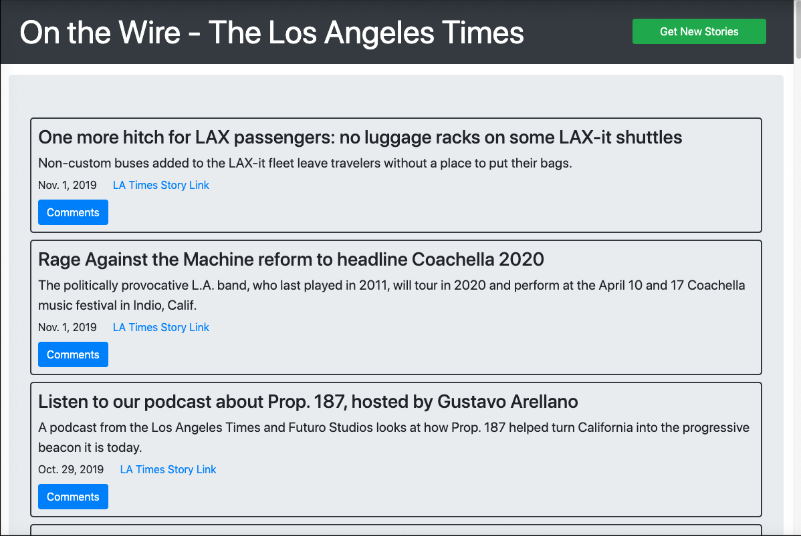
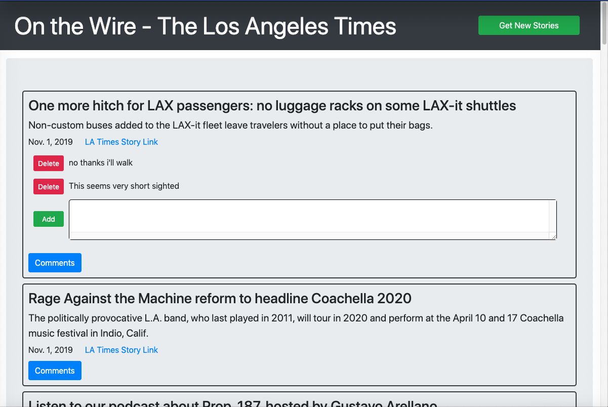

# News Scraper 

## Full Stack website that scrapes headlines from LA Times

## Description

This full stack web site scrapes story headlines from the LA Times and allows for user comments to be added/removed to each story.  Headlines, summary, link and comments are stored in a mongo database.

- #### Front-End Technology

  - HTML, CSS, JavaScript (ES6), jQuery, Bootstrap, Handlebars

  #### Back-End Technology

  - Node.js, Express.js, mongo.js, mongoose ORM, JavaScript (ES6), NPM packages (axios, cheerio,express, mongoose, morgan), Heroku

## Details:

- #### Github project :    <a href="https://github.com/mylescarey2019/NewsScraper">News Scraper Repository</a>

- #### Deployed Heroku link:  <a href="https://powerful-earth-53088.herokuapp.com">News Scraper</a>

- #### For further design and development details see: 

  - #### [UseCases and Psuedo Code](UseCases-PsuedoCode.md)

  - #### [Test Cases](TestCases.md)  

  - #### [Database Schema and SQL Queries](Database-Schema.md)

- #### Demo walkthru GIF : 

  - Use Cases seen in demo below
    - [x] scrap brings in new stories
    - [x] comment section:  add comments, deleted comments
    - [x] db persistence - browser refresh then app shows same comments

#### Screen Captures:

home page

comment section

## Getting Started

### Native and NPM Packages Used

1. express  - for interactive command line response 
2. mongoose - for database connectivity
3. axios - for web page scraping
4. cheerio - for JQuery like selection experience in node
5. handlebars - templating engine for rendering home page

### Dependencies

- none - 

### Installing

- none necessary - use link to page deployed on Heroku

### Executing program

- scrape new stories via nav button
- click on story comment button to open comment section
- add and delete comments
- link to LA Times story

#### Possible Enhancements

- [ ] allow user to mark stories as saved and purge old stories from db

## Authors

Myles Carey 
mylescarey2019@gmail.com 

## Version History

- 1.0 - Initial Release

## License

## Acknowledgments

Thanks to beta testers - my 15yo & 17yo daughters and wife 

